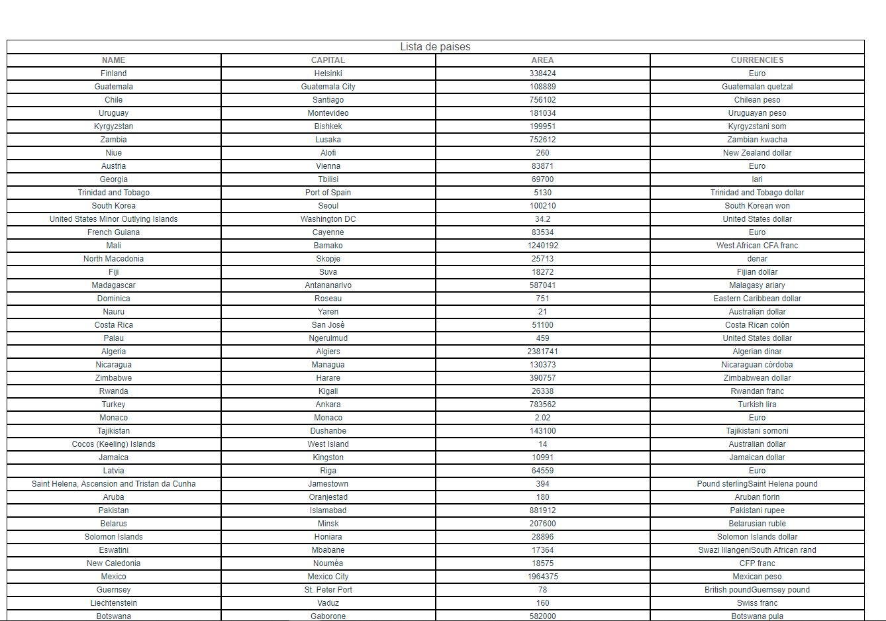

# api-paises

## Project setup
```
npm install 
vue create api-paises
```
## Informações
O projeto tem como ir no site e buscar Informações sobre os países.

### projeto


### Compiles and hot-reloads for development
```
npm run serve
```

